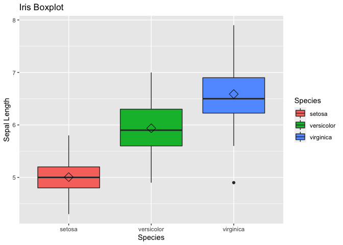

Programming Background
================
Jeremias Endrina
9/6/2021

## My Thoughts on R

I started my masters program at NC State taking ST555 where I learn how
to use SAS in gathering, processing, analyzing and presenting data.
Unfortunately, I have never used SAS again in any of succeeding courses.
Instead, I used R extensively as it is the required software in all of
my classes. I had a hard time in most of my classes for I don’t know how
to use R at that time. I have to spend extra time everyday to learn the
basic of it and be successful in those courses. Now, in my last semester
of the program, I am taking ST558 Data Science for Statisticians to
formalize what I learned about R. I am also enrolled in a Python class
which has lots of similarities to R in terms of concepts and syntax.

Based on my experiences, I can say that R has better packages and
functions which are easier to learn. It has packages that are constantly
being improved. Another is the R Markdown which makes presentation of
results nicer and easier to reproduce. Thanks to the people behind the
program who willingly devote their time to make R better.

## Example R Markdown Output

<!-- -->
